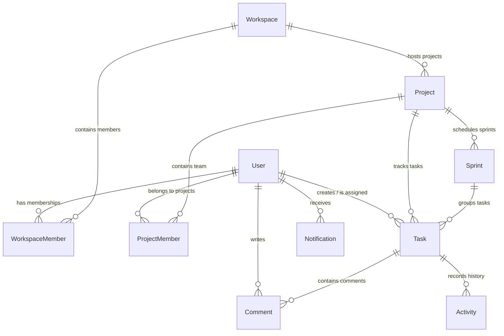

# Database Schema & Entity Relationships

Iterix uses MongoDB as its primary database. Below is the Entity-Relationship Diagram (ERD) and description of the database collections.

---

## 📊 Entity-Relationship Diagram (ERD)

---

## 📁 Collections & Fields Specifications

### 1. Users (`users`)
Stores registered developers, credentials providers, and user metadata.
* `name` (String, required): Full name.
* `email` (String, required, unique): Work/school email.
* `provider` (String, enum: `["email", "google"]`): Authentication mechanism.
* `isActive` (Boolean, default: `true`): Account status.
* `lastLogin` (Date): Timestamp of last sign-in.

### 2. Workspaces (`workspaces`)
The highest level of scoping (e.g., organisations or university classes).
* `name` (String, required): Workspace name.
* `description` (String, default: `""`): Short summary.
* `owner` (ObjectId -> User, required): Creator/primary administrator.
* `allowedDomain` (String, default: `null`): Restricts membership (e.g., `medicaps.ac.in`).

### 3. Workspace Members (`workspacemembers`)
Maps users to workspaces with specific admin/user roles.
* `workspace` (ObjectId -> Workspace, required): Target workspace.
* `user` (ObjectId -> User, required): Target member.
* `role` (String, enum: `["ADMIN", "MEMBER"]`): Permissions level.
* `isActive` (Boolean, default: `true`): Status of workspace membership.

### 4. Projects (`projects`)
agile projects nested inside workspaces.
* `name` (String, required): Project title.
* `projectKey` (String, required): 3-5 character prefix for tasks (e.g., `ITX`).
* `workspace` (ObjectId -> Workspace, required): Parent workspace.
* `taskCounter` (Number, default: `0`): Used to generate sequential task keys (e.g., `ITX-1`, `ITX-2`).

### 5. Project Members (`projectmembers`)
Maps workspace members to specific projects with scoped agile roles.
* `project` (ObjectId -> Project, required): Target project.
* `user` (ObjectId -> User, required): Workspace user.
* `role` (String, enum: `["TEAM_LEAD", "DEVELOPER"]`): Scoped role.

### 6. Sprints (`sprints`)
Milestones/sprint blocks for scheduling tasks.
* `name` (String, required): Sprint title (e.g. `Sprint 1`).
* `project` (ObjectId -> Project, required): Scoped project.
* `status` (String, enum: `["PLANNED", "ACTIVE", "COMPLETED"]`).
* `startDate` / `endDate` (Date).

### 7. Tasks (`tasks`)
Individual work tickets tracked on the Kanban board.
* `title` (String, required): Short summary.
* `description` (String): Details.
* `taskCode` (String, required): Key (e.g., `ITX-42`).
* `project` (ObjectId -> Project, required): Scoped project.
* `sprint` (ObjectId -> Sprint, default: `null`): Scheduled block.
* `workflowStage` (String, enum: `["BACKLOG", "SPRINT"]`).
* `status` (String, enum: `["TODO", "IN_PROGRESS", "IN_REVIEW", "DONE"]`).
* `priority` (String, enum: `["LOW", "MEDIUM", "HIGH", "CRITICAL"]`).
* `storyPoints` (Number, default: `0`).
* `assignee` (ObjectId -> User, default: `null`).
* `createdBy` (ObjectId -> User).

### 8. Comments (`comments`)
Collative thread logs under tasks.
* `task` (ObjectId -> Task, required).
* `user` (ObjectId -> User, required).
* `content` (String, required).
