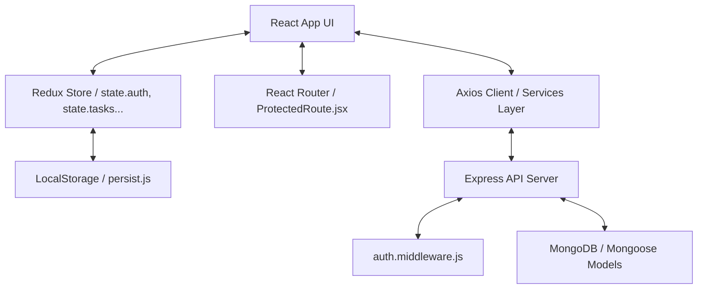

# Developer Hand-Over & Architecture Guide

This guide details the architectural flow, authentication system, and configuration guidelines for future developers maintaining or extending **Iterix**.

---

## 🏗️ Architecture & State Flow

Iterix is built as a single-page application (SPA) client communicating with a stateless REST API server.

### 1. State Persistence (`persist.js`)
* To prevent layout flashes and maintain user choices (like active themes or selected workspaces) during page refreshes, a debounce subscriber in [index.js](file:///C:/Users/Saarthak/Documents/Saarthak/Code/Collab%20Projects/Iterix/Frontend/src/store/index.js) updates a local storage object `Iterix-state-v1`.
* Only core config states (`auth` credentials cache, current `theme`, and active `currentWorkspaceId`) are cached in local storage. All data lists (projects, tasks, sprints, members) are fetched fresh from the database on page mount to ensure real-time synchronization.

---

## 🔐 Authentication & Session Lifecycle

The application uses a secure cookie-based JWT strategy:

1. **OTP / OAuth Flow:** The user logs in via Google Sign-In or by verifying their Email OTP code.
2. **Cookie Dispatch:** Upon validation, the backend generates a signed JSON Web Token (JWT) and dispatches it in an **HTTP-Only, Secure Cookie** named `token`.
3. **HTTP-Only Security:** Because the cookie is set to `httpOnly: true`, client-side JavaScript cannot read or access the token, preventing token theft via Cross-Site Scripting (XSS).
4. **Boot Check (`fetchMe`):** When the application mounts, the root `App.jsx` dispatches the `fetchMe` thunk. The backend reads the token cookie, verifies it against the `JWT_SECRET`, and returns the logged-in user profile, booting the workspace.

---

## 🛠️ Key Developer Hand-Off Checklists

### 1. Running Locally
* **Backend:** Ensure a local MongoDB instance or Atlas sandbox URI is configured in `Backend/.env`.
* **Frontend:** Configure your Google OAuth client credential ID in `Frontend/.env`.

### 2. Deployment Configurations
If deploying the frontend to **Vercel** and the backend to **Render**:
* **CORS Origin:** The backend `CLIENT_URL` environment variable must match the Vercel app domain (without a trailing slash) to allow cookie transmission.
* **Credentials:** In Axios/fetch settings, `withCredentials: true` must remain enabled so the browser automatically forwards the cookie on API requests.
* **SameSite Settings:** Ensure the cookie is configured with `sameSite: "none"` and `secure: true` in production so browsers allow cross-site cookie passing between different domains.
